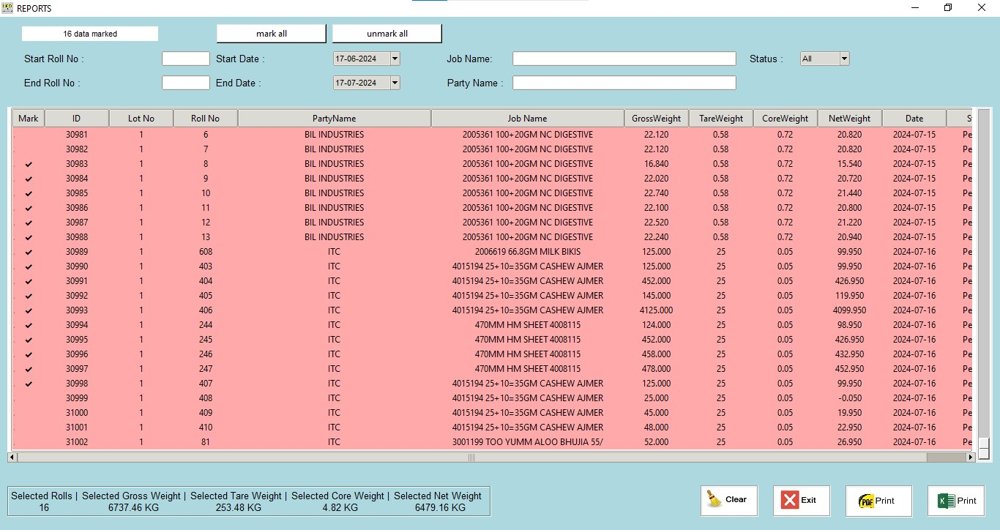
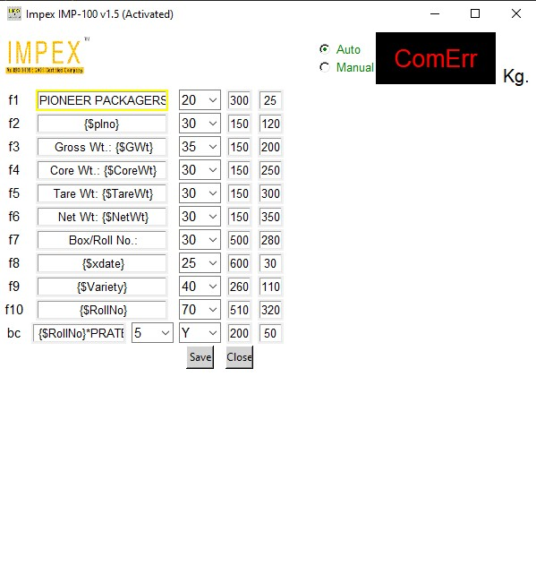
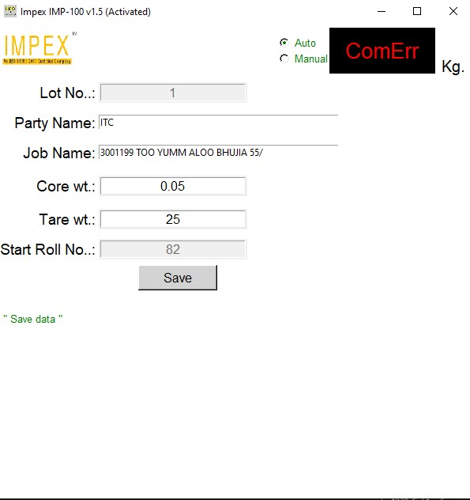
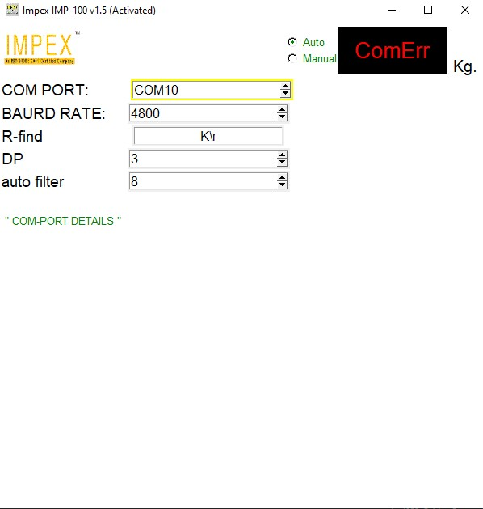

# Label Printing Scale Software
## Overview

The Label Printing Scale Software is a comprehensive solution for integrating weighing scales with a PostgreSQL database. This software features a graphical user interface (GUI) built with Tkinter, generates PDF reports using ReportLab, filters data with pandas, and implements fake scrolling for displaying large datasets. It also uses multiprocessing for stable weight integration via pySerial and automatic sticker printing. ZPL (Zebra Programming Language) files are generated using the simple-zpl2 library.

### Features

    - Tkinter GUI: User-friendly interface for ease of use.
    - ReportLab: Generate high-quality PDF reports.
    - pandas: Efficient data filtering and manipulation.
    - Fake Scrolling: Handles large datasets in report views.
    - Multiprocessing: Ensures stability in weight integration using pySerial.
    - Automatic Sticker Printing: Reliable and automatic printing of labels.
    - simple-zpl2: Generates ZPL files for label printing.

### Requirements

    - Python 3.7+
    - Tkinter
    - ReportLab
    - pandas
    - pyserial "readme
    - simple-zpl2
    - PostgreSQL

